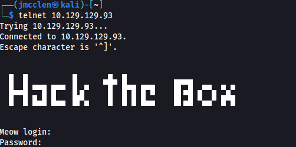
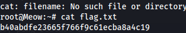

# Hack The Box - Tier 0 Notes

---

## Meow

### Reconnaissance

- Used `nmap -sV <target_ip>`
  - Revealed an open TCP port: `23`

### Telnet Access

Researched vulnerability and found that Telnet allows outside users to connect to a server simply using:

Prompted a login:

- Tested `root` as the username and gained access to the server
- Searched directories using `cd` and `ls`, found `flag.txt`
- Used `cat` to read the flag

Submitted root flag.

---

### What I Thought I Had To Do (Overthinking but useful)

Hydra brute-forcing (overlooked checking common root usernames):

---

### Extra Notes

- Decrypted MD5 hash on https://www.dcode.fr/md5-hash → `azerty`

---

## Protocol Notes — smbclient (Port 445)

Used to share files and printers over the same network.

**Syntax:**

**Common flags:**

- `-L` : lists shares on the SMB client
- `-N` : uses NULL password (no prompt)

**Helpful Links:**

- https://www.samba.org/samba/docs/4.9/man-html/smbclient.1.html  
- https://www.thehacker.recipes/infra/protocols/smb#theory

---

## Fawn

### Reconnaissance

- Ran Nmap scan
  - Found TCP port `21` open

### FTP Access

- Ran `ftp <ip>`
- Prompted for login — used `anonymous` for both user and password
- Used `get <filename>` to download file to local system
- File contained root flag

---

## Appointment

### Reconnaissance

- Found TCP port `80` open (Apache httpd)

### GoBuster

- Tool used to brute force directories on a website (e.g., hidden login pages, admin panels)

### SQL Injection

- Visited `http://<ip>`
- In the login form:
  - Username: `admin' #`
  - Password: anything
- Bypassed login using SQL injection

Why it worked:

Original query:

Injected:

The `#` commented out the rest of the query, skipping the password check.

---

